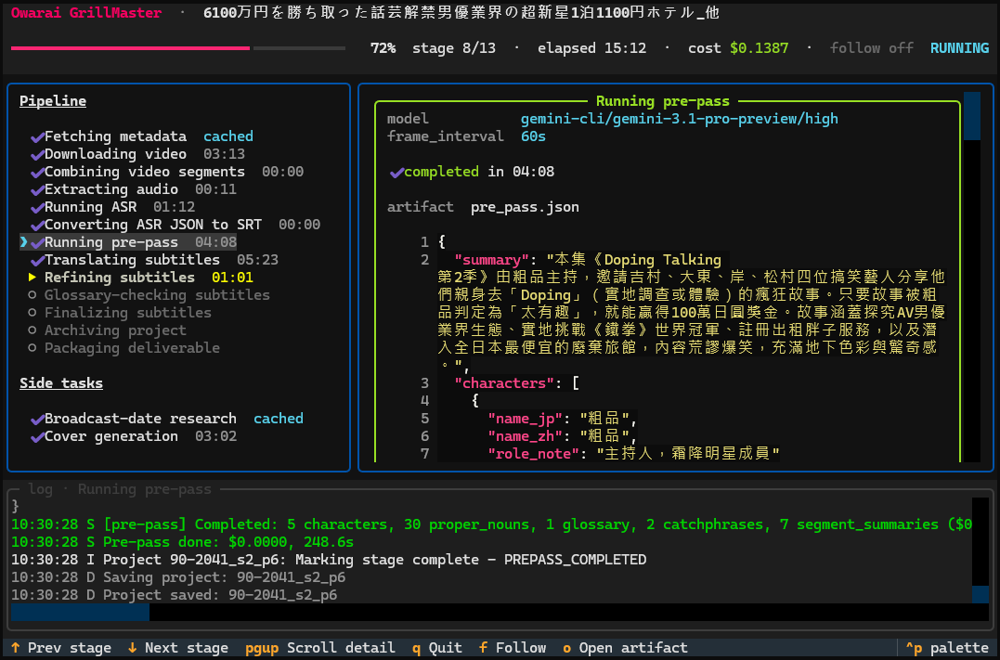
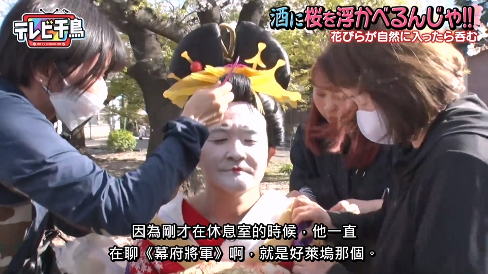
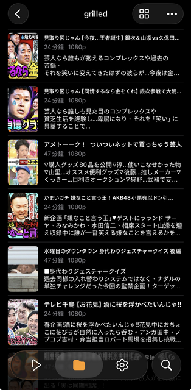
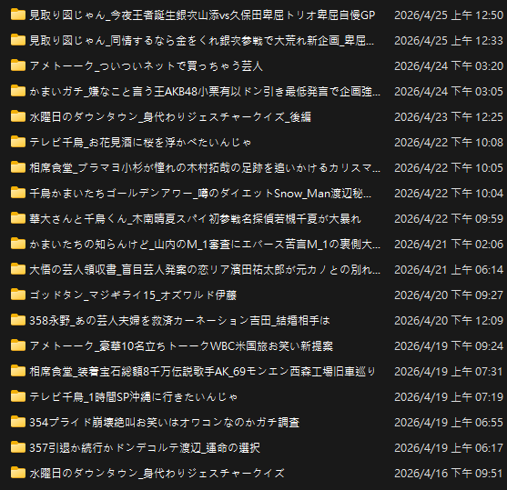
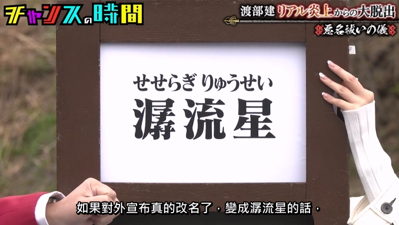

# Owarai GrillMaster

下載日本綜藝節目，生成繁體中文 SRT / ASS 字幕方便個人使用識讀






## 說明

- 目標是 one shot 即可直接觀看，不想校準 (避免被暴雷)
- 1 小時左右的影片成本大概 $20 台幣 (ASR $6 + 翻譯 $14)，處理時間約 15 分鐘，如果使用訂閱方式那就只有 ASR 成本
- 設定偏好都是個人主觀，如需修改請自行 fork
- 更詳細請[查看心得](docs/article.md)

## 工具

經過各種嘗試，API、自架等組合後，覺得以下方式最合適

- **ASR**：`ElevenLabs Scribe v2`，一堆人大聲喧嘩、裝傻吐槽沒有間隔也能辨識
- **翻譯**：`Gemini 3` 系列最能抓住日本綜藝的韻味，也很會看圖聽音檔；潤飾、名詞校對等後處理交給 Codex / Claude，輸出結構出錯時在同一個 session 內要求修正

翻譯分兩階段：先看完整部片做一份簡報（人物、專有名詞、梗的譯法、語氣），再把字幕切塊平行翻譯。翻譯時會參考音檔和影片截圖，幫助辨識人物、場景與畫面上的文字



中途失敗可以直接重跑同一個 ID，會從中斷的地方繼續

## 流程

```
下載影片 → 語音辨識 → 全片簡報 → 分塊翻譯 → 潤飾 → 名詞校對 → 輸出 ASS + SRT → 燒錄字幕 / 歸檔（可選）
```

## 安裝

需要 Python 3.13+、FFmpeg（加入 PATH）、uv，以及登入好的 agent CLI（`agy`、`codex`；Claude 走內建的 SDK）

```bash
uv sync
uv tool install --editable .   # 把 grill 裝到 PATH
```

或者把 `scripts/` 加到 PATH，用 `scripts/grill.bat` 執行 repo 內 `.venv` 的 `grill`

`grill` 會從目前目錄往上找 `grill.toml`，找不到就用 `GRILL_HOME` 指定的目錄；`projects/` 與 `.env` 都放在 `grill.toml` 旁邊。用 `uv tool install` 在其他目錄執行時，把 `GRILL_HOME` 設成 repo 根目錄即可

`grill doctor` 可以檢查 FFmpeg、各 agent CLI 與 `grill.toml` 是否就緒

## 使用方式

```bash
grill <影片 ID 或 URL> [翻譯提示]
```

翻譯提示可省略；影片標題與說明會自動帶入，翻譯提示是額外補充（例如 bilibili 標題太隱晦時）。已存在的專案在 pre-pass 跑完前仍可補上提示

```bash
grill BV18KBJBeEmV
grill BV1CakEBaEJp "華大千鳥 - 全力100萬 - 間諜 1/7"

# 只處理一段（完整影片仍會下載）
grill BV18KBJBeEmV --start 0 --to 5:00

# 跑到某個 stage 就停
grill BV18KBJBeEmV --break-after asr

# 依序處理多集，前一集的譯名會帶到下一集
grill serial ep100001 ep100002 ep100003

# 重新燒錄已完成的專案（可用 ID 或資料夾）
grill package <專案 ID 或資料夾>

# 打包成功但歸檔失敗時，只重做歸檔
grill archive <專案 ID>

# 從某個 stage 起重跑（會刪掉該 stage 之後的結果）
grill reset <專案 ID> --from refine

# 查看專案進度、模型與成本
grill status [專案 ID]
```

其他選項：`--cover`（產生封面）、`--date-research`（查不到播出日時上網找）、`--chat`（翻譯 YouTube 聊天室並燒進畫面，`--chat-layout side|overlay|none`）、`--remix [素材池]`、`--parent <專案資料夾>`。完整說明見 `grill --help`

## 設定

### `grill.toml`

複製 `grill.example.toml` 成 `grill.toml`（不進 git），每個鍵都有註解。檔案第一行 `#:schema ./grill.schema.json` 讓 Taplo / Even Better TOML 檢查格式並補全鍵名；修改設定格式後用 `uv run poe schema` 重新產生 schema

```toml
[paths]
archive = 'NAS:\video\ai'          # 完成後歸檔位置
package = 'NAS:\video\package'     # 燒錄字幕後的成品位置

[agents.roles]                      # 各角色模型，格式為 backend/model[/effort]
prepass = "agy/gemini-3.1-pro/high"  # backend：agy、claude、codex（皆為訂閱制；只有 agy 能聽音檔）
chunk = "agy/gemini-3.1-pro/high"
postprocess = "codex/gpt-6.1-sol/high"
utility = "codex/gpt-6.1-sol/medium"
image = "codex/gpt-6.1-sol/medium"   # 封面，需要能生圖的 codex

[features]
cover = true                        # 產生風格化封面
date_research = true                # 查不到播出日時上網找
title_suggestion = true             # 燒錄時產生候選標題
```

其他可調參數（切塊大小、併發數、抽圖頻率、remix 素材池等）請見 `grill.example.toml`

### 節目設定

`[programs.series."<系列名>"]` 或 `[programs.channel."<頻道名>"]` 依節目系列或頻道設定規則。下載時會自動為新出現的名稱加上空白區段，之後手動編輯：

- `remix`：`true` 時打包一律用 remix（同 `--remix`）
- `inserts`：打包時要附上的素材（對應 `[[package.inserts]]`）
- `instruction`：給各步驟模型的額外指示，鍵為 `prepass`、`chunks`、`refine`、`glossary`；`common` 會加到上述每個步驟。頻道與系列都有設定時兩者都會帶入

### `.env`

只放金鑰：

```env
ELEVENLABS_API_KEY=xxx
```

## 輸出

每個專案在 `projects/<影片 ID>/`：

- `subs/cht.ass`：套好樣式的繁中字幕
- `subs/cht.srt`：給不支援 ASS 的播放器
- `subs/ja.srt`：日文原文字幕（`ja.official.srt` 為平台官方字幕，有才有）
- `video.mp4`、`poster.jpg`、`cover.png`（有開封面時）
- `project.json`：專案狀態與各 stage 完成紀錄
- `work/NN_<stage>/`：各 stage 的中間產物與 agent session 紀錄
- `logs/`：每次執行的 log 與事件紀錄

設定 `[paths] package` 時，燒錄好的影片、封面與候選標題會輸出到該目錄；設定 `[paths] archive` 時，完成的專案會整個搬過去
